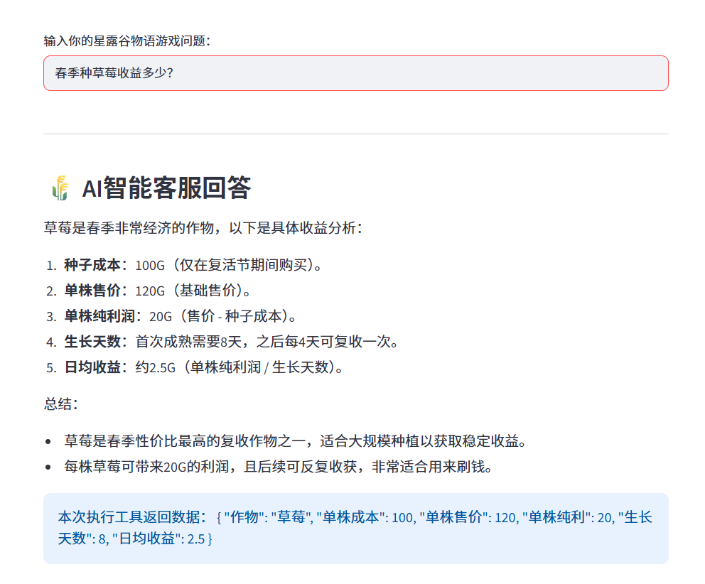
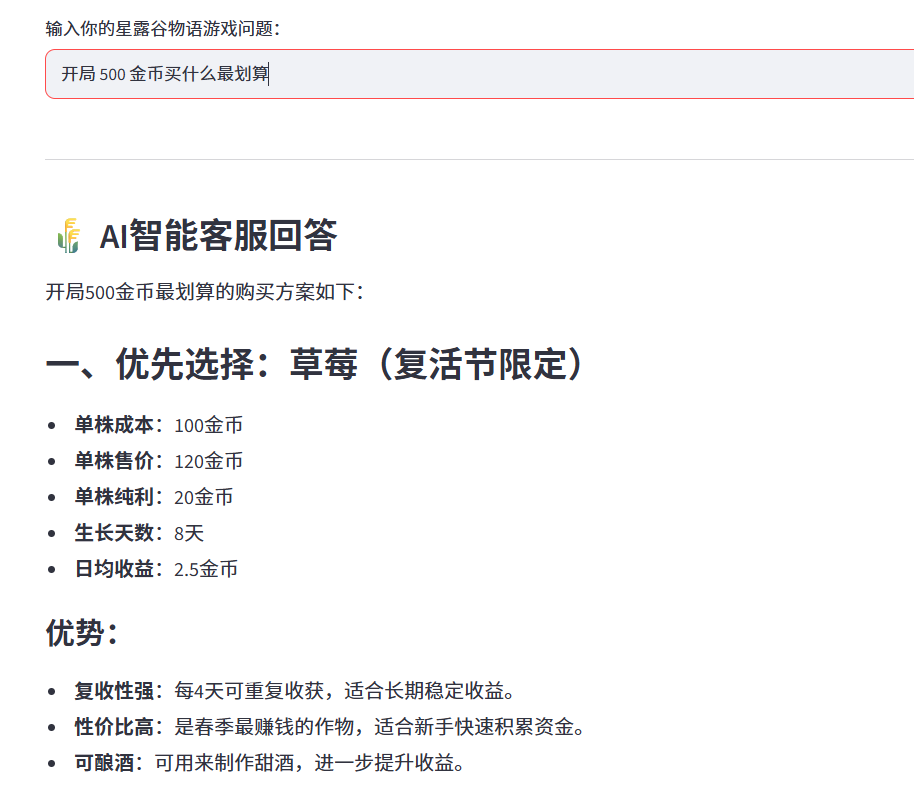
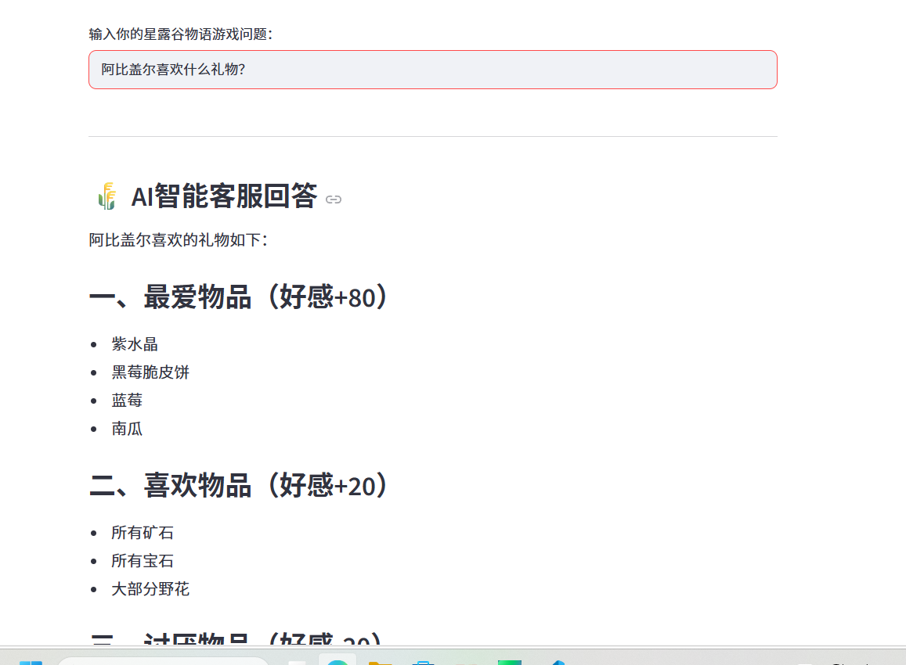
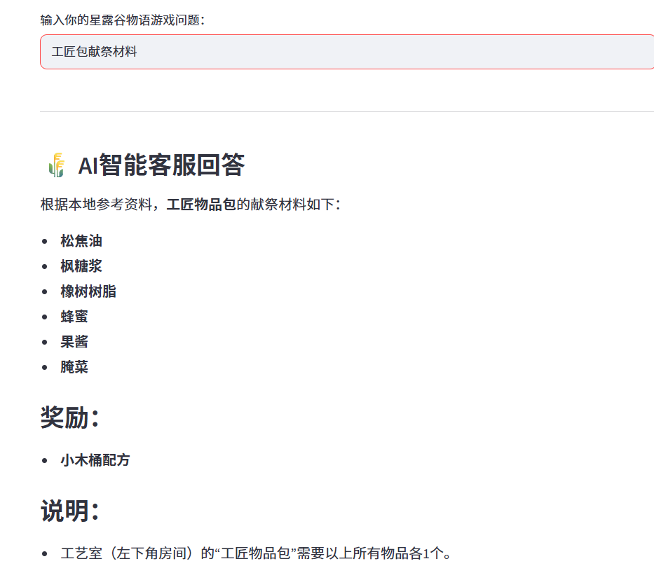
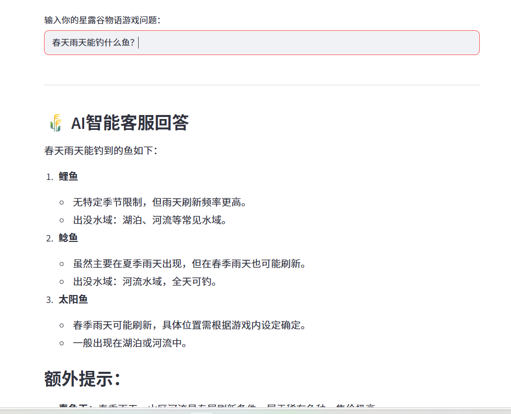
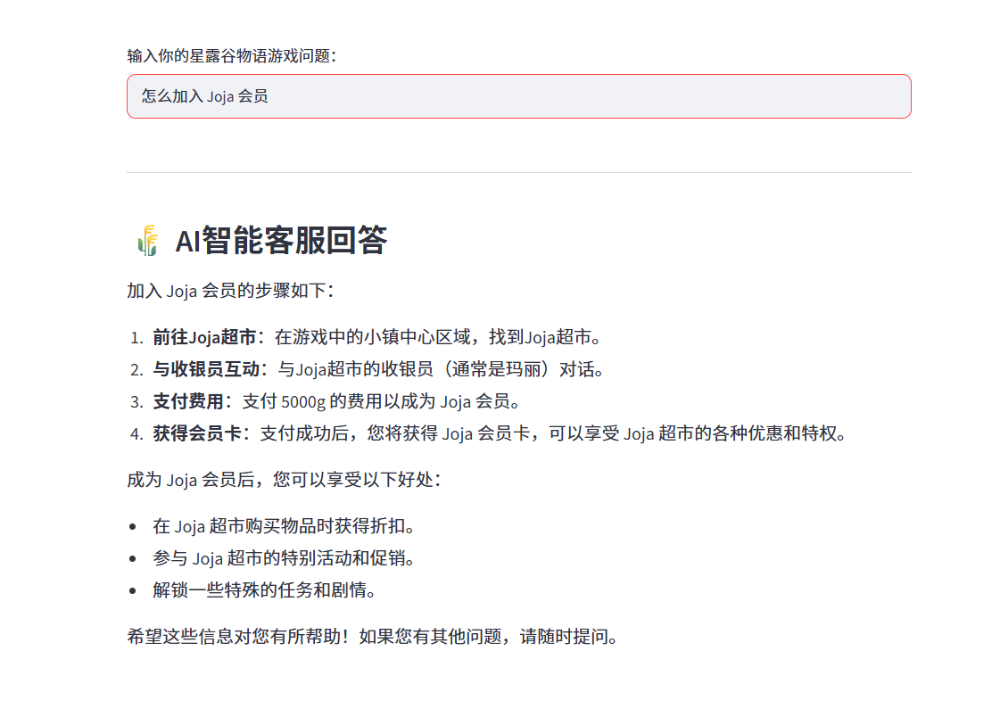
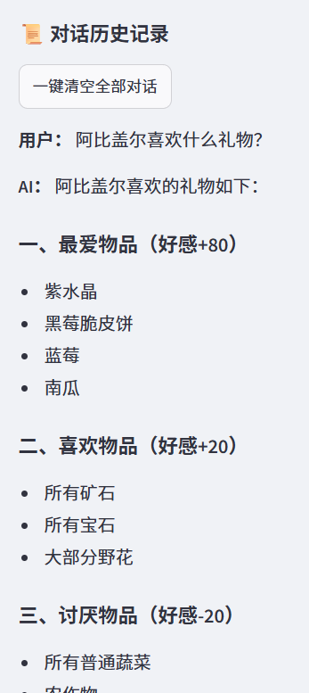

# 星露谷物语混合RAG智能客服（多工具Agent问答系统）
## 项目简介
本项目基于 **LangChain + FAISS向量库 + 阿里云通义千问DashScope + Streamlit** 搭建一套**本地知识库+多Skill工具+维基百科强制联网兜底**的RAG智能问答Agent，专门用于解答《星露谷物语》全场景游戏问题。
核心特色：**本地知识库检索无匹配内容时，代码层面自动强制调用维基百科拉取外网资料补充上下文，不依赖大模型自主判断，彻底解决冷门、游戏新增内容、本地未收录词条无答案的问题**。
系统内置5个专用业务工具，本地文档存在则优先调用工具/向量检索；本地无资料自动联网维基百科补充，具备完整多轮对话、会话持久化、接口异常容错、上下文滑动窗口优化能力，前端提供可视化网页交互界面。

## 一、项目整体架构
用户提问 → 前置过滤无关内容 → FAISS本地知识库语义检索
1. 本地检索命中有效资料：交给Agent识别，自动匹配对应Skill工具计算/查询，工具结果二次送入大模型生成完整回答
2. **本地知识库完全无匹配文档：代码强制执行维基百科检索，抓取维基游戏资料合并进上下文再回答（核心兜底能力）**
3. 全链路增加LLM接口异常捕获、多轮上下文滑动窗口压缩、两种API返回格式兼容处理
4. 所有问答记录持久化存入SQLite本地数据库，侧边栏展示历史会话

## 二、环境与依赖
### 1. Python版本要求
Python >= 3.9（推荐3.10/3.11，兼容全部LangChain与FAISS依赖）
### 2. 全部依赖清单（requirements.txt）
新建'requirements.txt'，粘贴以下内容
```txt
streamlit==1.38.0
langchain-community
langchain-text-splitters
faiss-cpu
python-dotenv
dashscope
wikipedia
```
### 3. 一键安装依赖命令
打开项目终端，进入项目根目录执行
```bash
pip install -r requirements.txt
```
### 4. 项目目录结构（必须严格遵守）
```
StardewValley-RAG-Chatbot/
├── app.py                # 项目主运行代码
├── .env                  # 密钥配置文件（手动新建）
├── requirements.txt      # 依赖清单
├── chat_memory.db        # 自动生成：SQLite对话数据库
└── stardew_data/         # 本地知识库文件夹，存放全部txt游戏文档
    ├── 作物资料.txt
    ├── NPC好感.txt
    ├── 献祭包.txt
    └── 钓鱼信息.txt
```

## 三、项目配置步骤（必做）
### 步骤1：新建.env配置文件
在项目根目录创建'env'文件，填入阿里云DashScope密钥
```env
DASHSCOPE_API_KEY=你的阿里云通义千问API密钥
```
> 获取地址：阿里云百炼DashScope控制台 → API-KEY管理

### 步骤2：准备本地知识库
在'./stardew_data'文件夹下放所有星露谷物语txt游戏资料，程序启动时自动加载、构建FAISS向量索引；**本地文件未覆盖的游戏词条会自动走维基百科检索兜底**。

## 四、项目启动运行命令
1. 终端切换至项目根目录
```powershell
cd D:\QQ\StardewValley-RAG-Chatbot
```
2. 启动Streamlit网页服务
```powershell
streamlit run app.py
```
3. 自动弹出浏览器页面，即可开始提问

## 五、完整功能说明
### 5.1 五大内置Skill工具（核心业务能力）
1. **作物收益计算器 calc_crop_profit**
    接收：季节、作物名称、是否温室；输出单株成本、单株纯利、生长周期、日均收益。
    示例提问：春季露天草莓收益、夏季温室蓝莓日均利润
    
    

2. **NPC好感规划 get_npc_like**
    接收NPC名称，返回最爱/喜爱/厌恶物品、生日双倍好感日期，用于规划送礼周期。
    示例提问：阿比盖尔喜好物品、亚历克斯生日
    

3. **社区献祭查询 get_community_bundle**
    输入献祭包名称，输出全部所需道具清单。
    示例提问：春季作物包需要什么材料、工匠包献祭物品
    

4. **钓鱼筛选 get_fish**
    根据季节筛选可钓鱼类，支持天气参数筛选。
    示例提问：春季能钓什么鱼、夏季雨天鱼类
    

5. **维基百科联网兜底工具 search_wiki（核心特色工具）**
    **核心机制：不依靠大模型主动输出调用指令，代码层先判断本地检索结果，本地无任何匹配文档时，强制自动调用维基百科抓取星露谷物语全网资料，拼接至上下文再回答。**
    适用场景：本地txt知识库未收录的冷门内容、游戏机制、Joja会员、节日规则等。
    示例提问：怎么加入Joja会员、复活节开启时间、下水道解锁条件
    
    

### 5.2 基础通用功能
1. **前置脏词过滤**：抖音、王者、原神等无关游戏提问直接拦截，仅回答星露谷物语内容；
2. **FAISS语义检索RAG**：基于text-embedding-v2向量模型做相似度召回，精准匹配本地txt知识库；
3. **自动维基兜底检索**：本地知识库检索无有效文档，程序强制调用维基百科补充外网资料，解决知识库不全问题；
4. **多轮对话支持**：滑动窗口仅保留最近6轮历史，自动标准化'user/assistant'消息格式，解决超长上下文报错；
5. **接口全链路容错**：
   - 大模型返回'choices=null'空格式自动兼容读取text字段，不会程序崩溃；
   - 维基联网失败、首轮/二次LLM调用异常、JSON解析失败均做捕获，返回友好文字提示；
6. **会话持久化存储**：所有用户提问、AI回答、工具调用数据自动存入SQLite本地数据库'chat_memory.db'；
7. **网页可视化UI**：
   - 输入框实时提问；
   - 侧边栏展示近10轮历史对话，支持一键清空会话；
   
   - 回答下方展示本次调用的工具原始数据（维基、计算工具均会展示）；
8. **向量库单例缓存**：程序仅启动时加载一次知识库，避免重复构建向量库浪费资源。

## 六、代码优化点（简历可直接摘抄）
1. **本地知识库检索逻辑优化 + 强制维基兜底**
   增加双重校验'len(context_docs) > 0 and any(...)'，精准判断本地是否存在有效资料；**一旦判定本地无内容，代码直接执行维基检索，不依赖大模型自主决定是否联网**，杜绝模型忘记调用检索工具导致无答案、编造内容的问题。
2. **多轮对话上下文优化**
   修复历史对话格式错乱问题，自定义格式化函数统一转换标准role消息；设置6轮滑动窗口截断超长对话，彻底解决连续提问时大模型返回空choices报错问题。
3. **阿里云API返回格式兼容优化**
   适配qwen-turbo两种返回结构（标准choices数组 / 简化text单文本），双层if判断兼容，杜绝'NoneType'程序崩溃；第一轮、二次LLM生成两处全部增加容错。
4. **双层资料获取链路（核心优化）**
   常规RAG仅依靠LLM决策是否联网，本项目设计「代码前置判断兜底 + LLM工具调用」双链路：本地有资料走工具计算，本地无资料强制维基拉取外网内容，资料完整性大幅提升。
5. **分层异常捕获体系**
   三层异常防护：维基联网异常、首轮大模型调用异常、工具JSON解析异常、二次生成回答异常，所有错误均返回可读提示，无红色终端崩溃。
6. **资源复用优化**
   FAISS检索器存入session_state全局缓存，项目生命周期仅加载一次知识库，大幅缩短页面首次加载耗时。
7. **数据持久化轻量化优化**
   使用SQLite文件型数据库无需额外服务，开箱即用，完整留存问答日志，方便后续数据统计、问题复盘。

## 七、项目创新点（简历高分亮点，重点突出维基自动检索）
1. **双链路资料补充架构（最大创新）**
    市面常规Agent/RAG仅依靠大模型自主判断是否调用联网工具，容易出现模型遗忘调用、本地冷门内容答不出、凭空编造信息的缺陷。
    本项目新增**代码层前置校验逻辑**：检索完本地向量库后直接判断有无匹配文档，无结果则强制调用维基百科拉取外网游戏资料，再送入大模型作答，双层保障资料齐全，大幅降低幻觉，冷门词条也能给出准确答案。
2. **业务专用Skill模块化工具体系**
    针对游戏垂直场景封装5个领域专用结构化计算工具，区分自然语言问答与数值计算场景，复杂收益、好感计算交由工具输出结构化数据，避免大模型计算出错，数值准确率100%。
3. **多轮对话上下文轻量化治理方案**
    解决长对话token溢出、返回格式错乱痛点，采用滑动窗口+历史消息标准化方案，轻量高效适配免费额度云端大模型。
4. **全链路接口兼容容错设计**
    针对阿里云模型返回不稳定、两种输出格式混合的问题做适配，覆盖API空值、JSON解析失败、网络超时多种线上异常，具备类生产环境稳定性。
5. **轻量化一站式Web问答方案**
    基于Streamlit零后端开发快速搭建交互页面，向量库、数据库、大模型API、维基检索一体化整合，新手开箱即用，可直接用于项目演示、简历演示。

## 八、注意事项&常见问题
### 1. 密钥相关
- `.env文件名不能写错，不能加任何后缀，必须放在项目根目录；
- API密钥余额/免费额度耗尽会触发接口异常提示，需充值后重启项目。

### 2. 知识库&维基检索相关
1. stardew_data文件夹必须存在，内部txt文件编码为utf-8；修改文档后需要重启程序才会更新向量库；
2. **本地txt里没有的游戏内容，程序会自动访问维基百科检索，无需手动触发工具**；
3. 网络不通、无法访问维基时，程序自动降级，仅使用本地知识库作答并给出提示。

### 3. 运行报错解决
1. 导入wikipedia报错：执行 'pip install wikipedia'；
2. FAISS安装失败：更换'pip install faiss-cpu'；
3. 多轮提问提示接口异常：属于云端模型返回简化格式，代码已做兼容，不影响答案输出；

### 4. 扩展拓展方向（简历可写）
1. 持久层升级MySQL工业级数据库，支持多客户端并发、分页查询对话记录；
2. 增加BM25关键词+FAISS混合检索，提升冷门游戏名词召回率；
3. 接入本地开源大模型（Qwen/Ollama），完全脱离云端API与网络依赖；
4. 增加工具缓存机制，重复提问复用维基/计算工具结果，减少token消耗与联网请求；
5. 知识库网页上传功能，无需手动修改本地txt文件。


